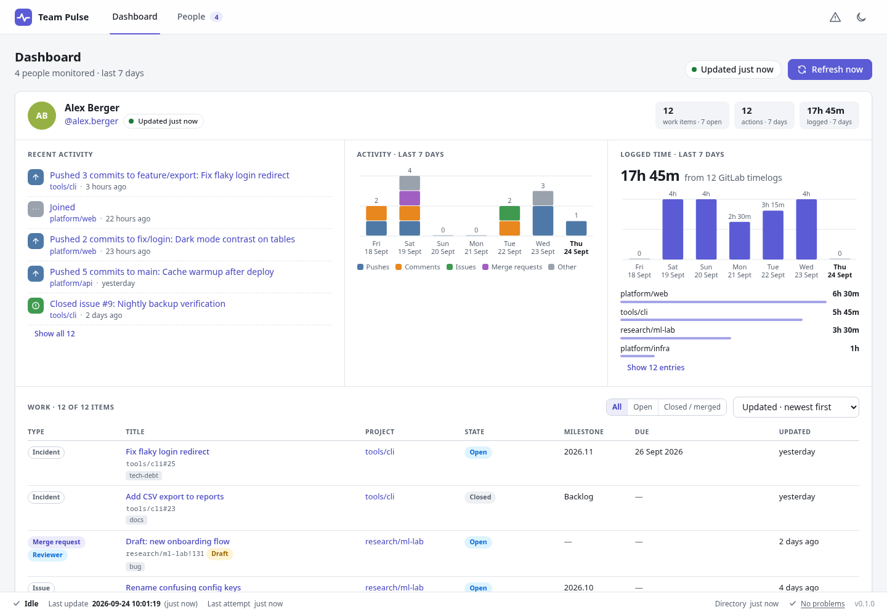
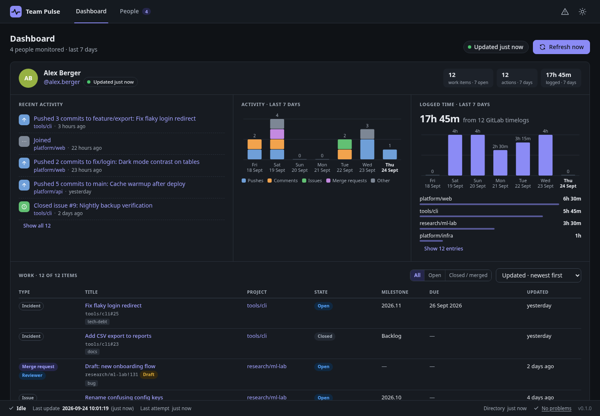
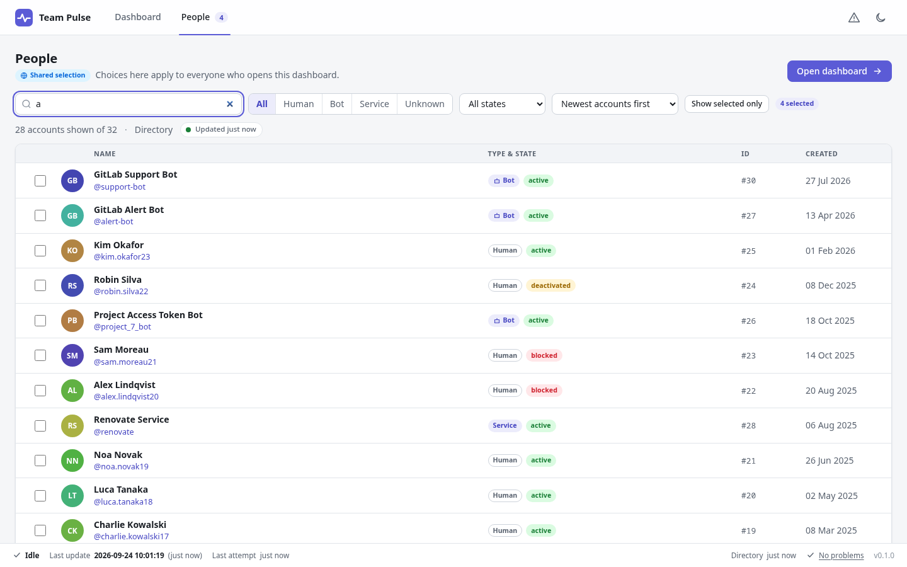
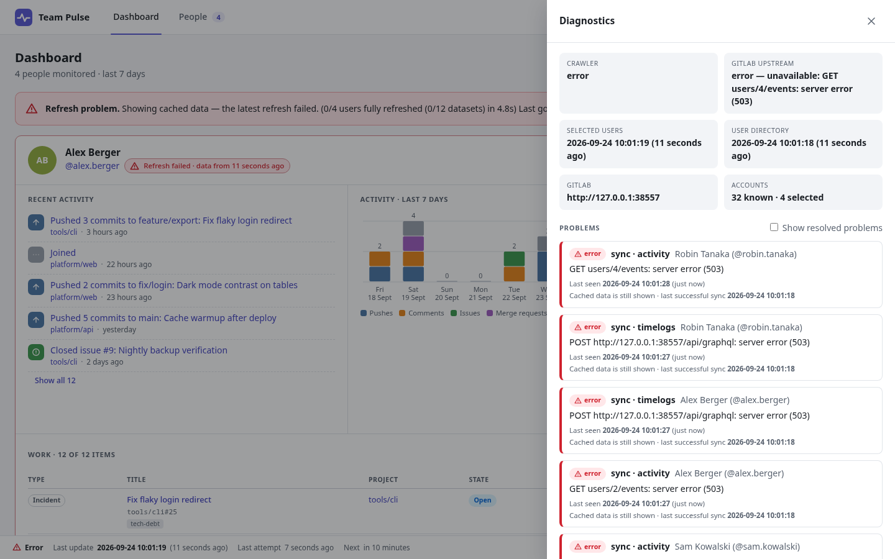

# GitLab Team Pulse

[](https://github.com/marcelpetrick/GitLabTeamPulse/actions/workflows/local-pipeline.yml)
[](https://github.com/marcelpetrick/GitLabTeamPulse/actions/workflows/docker.yml)
[](https://github.com/marcelpetrick/GitLabTeamPulse/tags)
[](https://github.com/marcelpetrick/GitLabTeamPulse/pkgs/container/gitlabteampulse)
[](LICENSE)
[](https://www.python.org/)
[](https://fastapi.tiangolo.com/)
[](pyproject.toml)
[](https://www.conventionalcommits.org/)

A people-centric dashboard for a **self-managed GitLab** instance. Pick a handful of GitLab
accounts once, and everyone who opens the page sees what those people have recently worked on:
assigned issues and merge requests in every state, their last twelve actions, seven days of
activity and seven days of actual GitLab timelogs. It also shows exactly how fresh all of it is.

**Author: Marcel Petrick <mail@marcelpetrick.it>**

**License: GPLv3 or later. See [`LICENSE`](LICENSE).**

**Note: project is generated with AI.**



| Dark mode | People view |
| --- | --- |
|  |  |

When GitLab is unreachable, the dashboard keeps the last known good data, marks it with an
icon and a text label (color is never the only signal), and explains the problem in the
diagnostics drawer:



## What it does

- **Complete user directory**: every account the token can see, including bots, service
  accounts, and blocked or deactivated users. It refreshes hourly, supports a live filter while
  typing and six sort orders, and the selection survives filtering.
- **Global, persistent selection**: stored in SQLite and shared by all viewers. A newly
  selected user is synchronized right away.
- **Per-person card**:
  - Work: assigned issues, merge requests, MRs to review and epics (where the instance
    supports them, see [GraphQL](docs/GRAPHQL.md#2-epics-work-items)) in *every* state, sorted newest
    first. You can re-sort locally by update time, title, project, state, due date or type.
  - Activity: the five latest actions at a glance, with all twelve one click away.
  - Charts: a stacked seven-day activity chart (pushes, comments, issues, merge requests,
    other) and daily logged time with per-project totals.
- **Facts only**: time comes from GitLab timelogs (one
  [GraphQL query](docs/GRAPHQL.md#1-timelogs-actual-logged-time) per user), never estimated. Nothing is scored, and
  there is no hard-coded 40-hour judgment. A week with no logged time is simply highlighted.
- **Cached first**: the browser reads only the local SQLite cache and polls a compact
  `/api/status` for a `data_version` change. GitLab is crawled in the background: selected
  users every ten minutes, the directory hourly, and immediately on **Refresh now**.
  Duplicate refreshes are coalesced and refresh storms are throttled.
- **Last known good wins**: a failed refresh never replaces good data. Retention cleanup keeps
  SQLite compact but never deletes the only good snapshot, even after days of outage.
- **Explicit freshness**: exact timestamps plus "10 seconds ago" for everything. It
  distinguishes fresh, refreshing, stale, error and never-synced states, per user and per
  dataset (work, activity, timelogs fail independently).
- **Low GitLab load**: detailed crawling only for selected users, project metadata only on
  demand, incremental activity sync, bounded concurrency, and retries with backoff and jitter.
  Authentication errors fail fast.
- **Polished, dependency-free UI**: plain HTML, CSS and ES modules served by FastAPI, native
  SVG charts, no CDN, and no Node.js build. It has light and dark themes (kept for the browser
  session), keyboard support, and all data text stays selectable and copyable.

## Quick start: try it without a GitLab

```bash
uv sync
uv run gitlab-team-pulse demo        # http://127.0.0.1:8000, backed by a built-in fake GitLab
```

The demo starts a deterministic fake GitLab API (32 accounts, 6 projects, work, events and
timelogs), pre-selects four people and serves the dashboard. With Docker:

```bash
docker run --rm -p 8000:8000 ghcr.io/marcelpetrick/gitlabteampulse:latest demo --host 0.0.0.0
```

## Run it against your GitLab

1. Create a token with the **`read_api`** scope. An **administrator** token is recommended:
   without admin rights, GitLab hides blocked, deactivated and internal accounts, and the
   dashboard says so in its diagnostics instead of silently claiming completeness. The
   top-level GraphQL `timelogs` query may also require admin rights on some versions
   (see [`docs/GRAPHQL.md`](docs/GRAPHQL.md#permissions)). No write scope is ever needed.
2. Configure and start:

```bash
export TEAMPULSE_GITLAB_URL=https://gitlab.example.com
export TEAMPULSE_GITLAB_TOKEN=glpat-...          # or TEAMPULSE_GITLAB_TOKEN_FILE=/path/to/secret
uv run gitlab-team-pulse doctor                  # checks config, database, GitLab, token rights, timelogs
uv run gitlab-team-pulse serve                   # http://127.0.0.1:8000
```

It can also be installed as a standalone tool: `make build && pipx install dist/gitlab_team_pulse-*.whl`
(or `uv tool install .`).

### Docker / Compose (recommended for servers)

```bash
mkdir -p secrets && printf '%s' 'glpat-...' > secrets/gitlab_token && chmod 600 secrets/gitlab_token
TEAMPULSE_GITLAB_URL=https://gitlab.example.com docker compose up -d
```

[`compose.yaml`](compose.yaml) mounts the token as a Docker secret (`/run/secrets/gitlab_token`,
read automatically) and keeps SQLite on the `teampulse-data` volume. The container:

- runs as the non-root user `teampulse` (uid 10001) with `/data` at mode 0700;
- applies migrations as an explicit startup step, then runs Gunicorn with exactly **one**
  Uvicorn worker, so the in-process scheduler has a single owner;
- logs human-readable lines to stdout and exposes a `HEALTHCHECK` on `/api/health`.

Images are published to `ghcr.io/marcelpetrick/gitlabteampulse` for `linux/amd64` and
`linux/arm64`, tagged `latest`, `<version>`, `vX.Y` tags and `sha-<commit>`.

### Configuration

All settings are environment variables (an ignored `.env` file works too). None of them
require a code change.

| Variable | Default | Purpose |
| --- | --- | --- |
| `TEAMPULSE_GITLAB_URL` | — | Base URL of the self-managed GitLab |
| `TEAMPULSE_GITLAB_TOKEN` | — | API token (fallback when no secret file exists) |
| `TEAMPULSE_GITLAB_TOKEN_FILE` | `/run/secrets/gitlab_token` | Secret file, preferred over the variable |
| `TEAMPULSE_GITLAB_VERIFY_TLS` | `true` | TLS verification |
| `TEAMPULSE_GITLAB_CA_BUNDLE` | — | Custom CA bundle for on-premise certificates |
| `TEAMPULSE_GITLAB_CONCURRENCY` | `4` | Maximum parallel GitLab requests |
| `TEAMPULSE_GITLAB_TIMEOUT_SECONDS` / `_MAX_RETRIES` | `20` / `3` | Request timeout and bounded retries |
| `TEAMPULSE_DATABASE_PATH` | `~/.local/share/gitlab-team-pulse/teampulse.db` | SQLite file (container: `/data/teampulse.db`) |
| `TEAMPULSE_HOST` / `TEAMPULSE_PORT` | `127.0.0.1` / `8000` | Bind address (container: `0.0.0.0`) |
| `TEAMPULSE_LOG_LEVEL` | `INFO` | `DEBUG` … `CRITICAL` |
| `TEAMPULSE_SELECTED_REFRESH_INTERVAL_SECONDS` | `600` | Selected-user refresh |
| `TEAMPULSE_USER_REFRESH_INTERVAL_SECONDS` | `3600` | Directory refresh |
| `TEAMPULSE_UI_POLL_INTERVAL_SECONDS` | `20` | Browser polling of the local backend |
| `TEAMPULSE_STALE_GRACE_SECONDS` | `120` | Grace before data is shown as stale |
| `TEAMPULSE_MANUAL_REFRESH_MIN_INTERVAL_SECONDS` | `10` | Refresh-storm protection |
| `TEAMPULSE_RETENTION_HOURS` / `TEAMPULSE_ERROR_RETENTION_DAYS` | `24` / `7` | Rolling cache and resolved-error retention |
| `TEAMPULSE_WORK_WINDOW_DAYS` | `30` | "Recently relevant" work window |
| `TEAMPULSE_ACTIVITY_DAYS` | `7` | Activity and timelog window |
| `TEAMPULSE_TIMEZONE` | `UTC` | Time zone for calendar-day buckets |

The token is never written to SQLite, logs (a redaction filter guards them), API responses or
exception text shown in the UI. It is sent only to the configured GitLab host, and pagination
links pointing elsewhere are refused.

## Architecture

```text
Browser (HTML/CSS/ES modules, SVG charts)
   │  polls /api/status (data_version) · reads /api/dashboard, /api/users · PATCH selection · POST refresh
FastAPI app (single worker) ── security headers (CSP, no CORS), cached reads only
   │
   ├── Scheduler (asyncio): directory hourly · selected users every 10 min · cleanup hourly
   │        └── manual refresh coalescing and throttling, immediate sync for newly selected users
   ├── SyncService: per-user, per-dataset transactions; last-known-good; diagnostics
   │        └── GitLabClient (httpx): REST + GraphQL (timelogs, epics), pagination, retries, bounded concurrency
   └── SQLite (SQLAlchemy + Alembic, WAL, foreign keys) ── users, work items, events, timelogs,
            projects, sync state, runs, errors
```

| Module | Responsibility |
| --- | --- |
| `gitlab/` | The only code that speaks HTTP to GitLab (REST and [GraphQL](docs/GRAPHQL.md)) or reads raw payloads; typed errors |
| `sync.py`, `scheduler.py` | Synchronization, freshness bookkeeping, scheduling |
| `store.py`, `models.py`, `migrations/` | Persistence and schema history |
| `retention.py` | Rolling cleanup that never removes the only good snapshot |
| `dashboard.py`, `app.py` | Batched read model (no N+1 queries) and HTTP API |
| `fake_gitlab.py` | Deterministic fake GitLab for demo, integration and browser tests |

HTTP API: `GET /api/health`, `/api/status`, `/api/users`, `/api/dashboard`,
`/api/users/{id}/work|activity|time-summary`, `/api/errors`, `PATCH /api/users/{id}/selection`,
`POST /api/refresh` (202 or 429 with `Retry-After`). Interactive docs are at `/api/docs`.

Why and how GitLab's GraphQL API is used (timelogs and epics) and what it saves compared
with REST is explained in [`docs/GRAPHQL.md`](docs/GRAPHQL.md).

## Development

```bash
make install     # uv sync --locked
make test        # unit + integration tests, coverage gate 95%
make e2e         # Playwright/Chromium browser tests against real HTTP servers
make lint typecheck format
make demo        # run against the fake GitLab
./localPipeline.sh   # everything CI runs, plus a Docker smoke test and an optional demo launch
```

`localPipeline.sh` runs these stages: uv sync, Ruff lint, Ruff format check, strict mypy, a
migration of a fresh database, tests with coverage, browser E2E, package build, and a wheel
smoke test in a clean venv (serving the demo from the installed wheel). It then runs a Docker
build with a container smoke test, opens the coverage report and launches the demo, and prints
a summary. The GitHub Actions workflow and [`.gitlab-ci.yml`](.gitlab-ci.yml) run the same
script. `Docker Image` publishes to GHCR after an end-to-end container smoke test that covers a
Docker secret, a fake GitLab and a restart with a persistent volume.

Tests never need a live GitLab. They cover normalization, pagination, retries and rate
limits, freshness, retention, last-known-good behaviour (including the VISION §37.3 outage
scenario), migrations and drift, the API, the CLI and the browser flows from VISION §37.4.

### Versioning and commits

[Semantic Versioning](https://semver.org/): every commit bumps the patch version and major
features bump the minor version (`tools/bump_version.py`). Commits follow
[Conventional Commits](https://www.conventionalcommits.org/) and are atomic, with the version
appended, e.g. `feat(docker): … (v0.1.0)`. See [`CHANGELOG.md`](CHANGELOG.md).

## Documentation

- [`VISION.md`](VISION.md): full product requirements and acceptance criteria.
- [`docs/GRAPHQL.md`](docs/GRAPHQL.md): what GraphQL is, why it is used for timelogs and
  epics, and how many requests it saves compared with REST.
- [`CHANGELOG.md`](CHANGELOG.md): release history.
