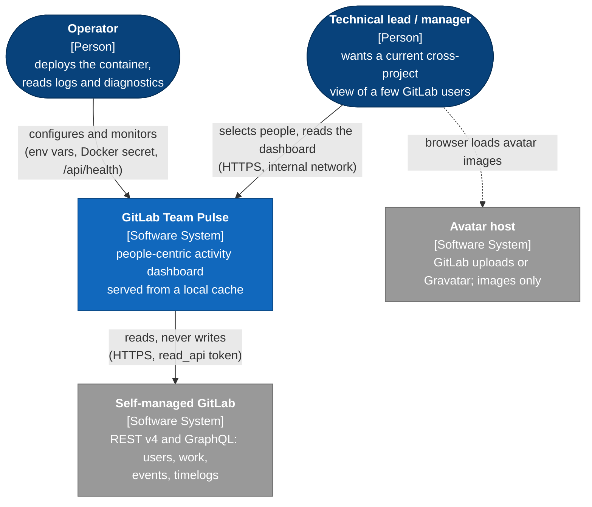
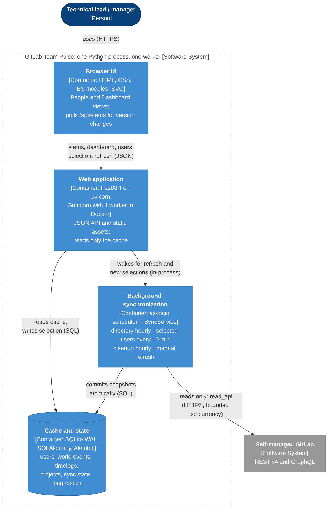
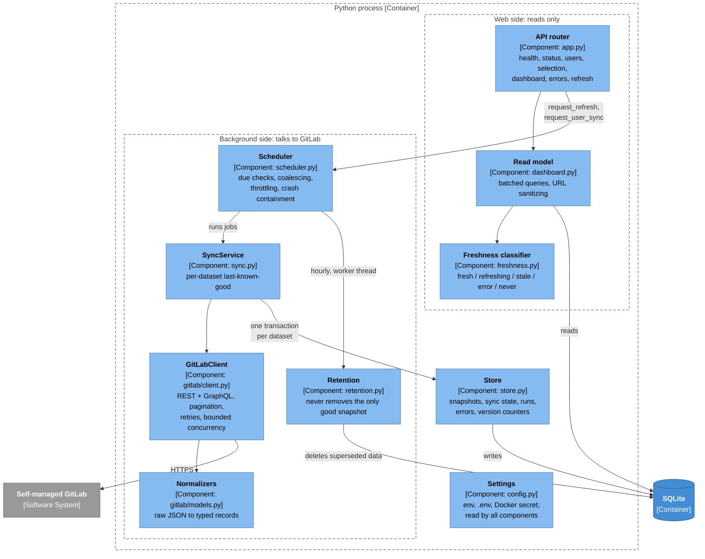
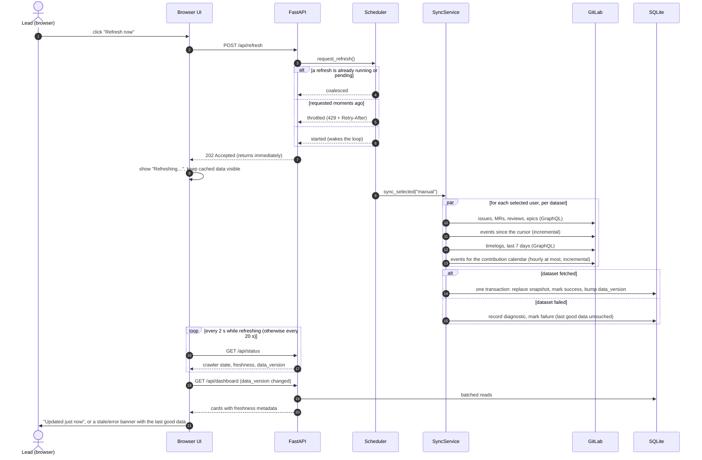
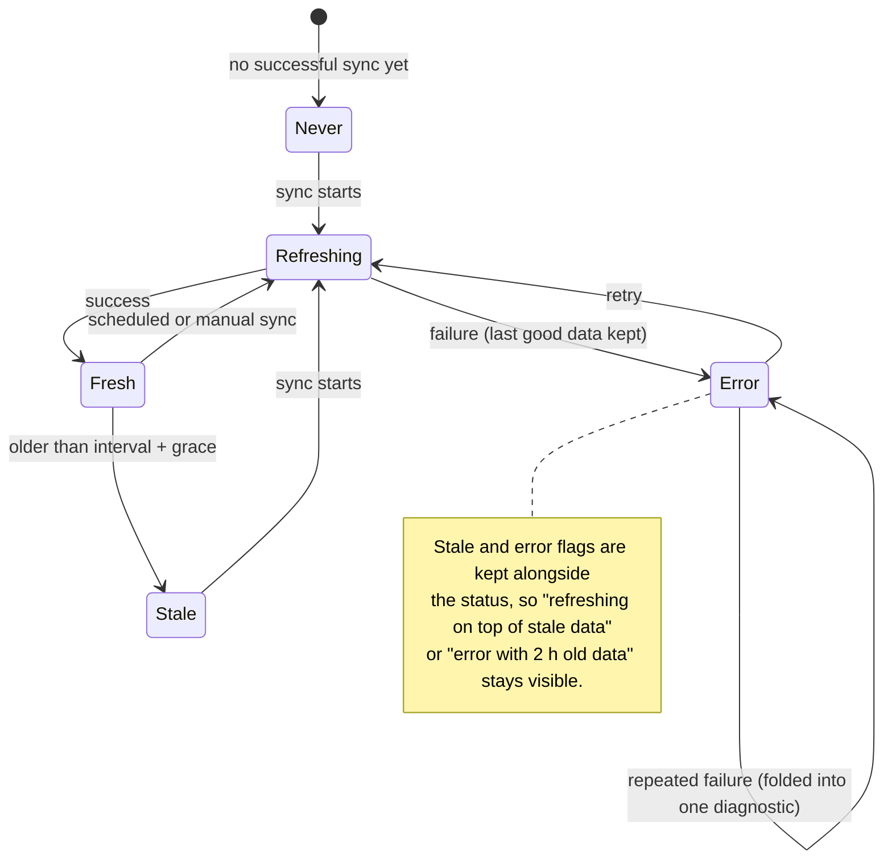
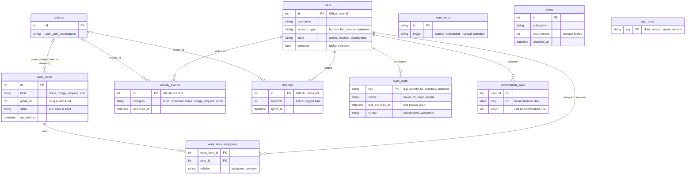
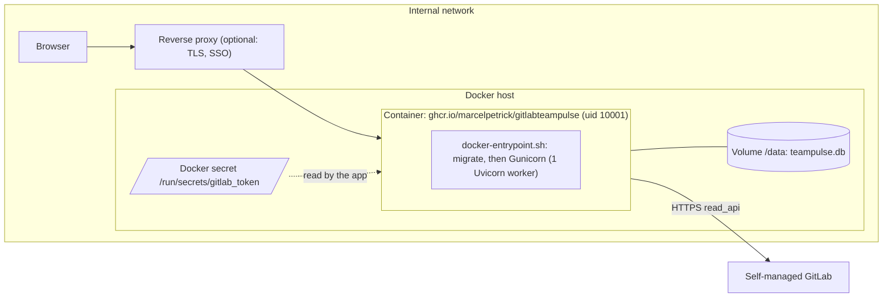

# Architecture

This document describes GitLab Team Pulse with the [C4 model](https://c4model.com/): system
context (level 1), containers (level 2) and components (level 3). It adds a dynamic view of
the refresh flow, the freshness state model and the data model. All diagrams are
[Mermaid](https://mermaid.js.org/), so they render on GitHub and GitLab and stay reviewable as
text next to the code. The diagrams use C4 notation (people, software systems, containers,
components, boundaries, the usual C4 colours and `[Type: technology]` labels) drawn as Mermaid
flowcharts. Mermaid's experimental `C4Context` layout overlaps labels, and flowcharts render
cleanly everywhere Mermaid is supported.

Related documents: [`README.md`](../README.md) (usage and configuration),
[`GRAPHQL.md`](GRAPHQL.md) (why GraphQL is used for timelogs and epics),
[`VISION.md`](../VISION.md) (requirements) and [`CHANGELOG.md`](../CHANGELOG.md).

## Architectural drivers

The decisions below follow from a few requirements in the vision:

| Driver | Consequence in the design |
| --- | --- |
| Fast UI, never blocked by GitLab (§5.4, §31) | The browser reads only the local SQLite cache; GitLab is crawled in the background |
| Resilience: never replace good data with failure (§5.5, §17) | Per-user, per-dataset transactions; failures record diagnostics but keep the last good snapshot |
| Minimal GitLab load (§5.6, §20) | Detailed crawling only for selected users, incremental activity, on-demand project metadata, bounded concurrency |
| Observable by default (§5.7, §29) | Freshness on every payload, persisted diagnostics, readable stdout logs |
| Simple deployment (§5.8, §21.5) | One Python process, one SQLite file, exactly one worker (single scheduler owner) |
| No Node.js toolchain, no CDN (§22) | Plain HTML/CSS/ES modules and native SVG charts shipped inside the Python package |

## Level 1: System context

- **Only the server talks to GitLab.** The browser never calls GitLab, and the token never
  leaves the server.
- **Read-only.** A `read_api` token is enough, and no mutations are ever sent.
- **Trust model.** Anyone on the internal network can open the app (VISION §6.3); access is
  limited by deployment (firewall, reverse proxy), not by a login screen.

## Level 2: Containers

| Container | Technology | Responsibility | Scaling note |
| --- | --- | --- | --- |
| Browser UI | Static files in `static/` | Rendering, filtering, sorting and theme, all client-side | Polling is cheap: a compact `/api/status` plus version counters |
| Web application | FastAPI (`app.py`) | HTTP API, security headers (CSP, no CORS), static assets | Stateless reads from SQLite |
| Background synchronization | `scheduler.py`, `sync.py` | Everything that talks to GitLab | **Exactly one instance**: it owns the scheduler |
| Cache and state | SQLite (`models.py`, `migrations/`) | Read model and application state | One file on a persistent volume (`/data`) |

The web application and the synchronization run in **one process**. That is why deployments
use a single worker: several workers would start several schedulers against the same database
(VISION §21.5, §44.1).

## Level 3: Components (inside the Python process)

### Component rules

- **One door to GitLab.** Only `gitlab/` speaks HTTP to GitLab or sees raw JSON (VISION §27).
  Everything else works with typed `GitLabUser`, `WorkItem`, `ActivityEvent` and `Timelog`
  records. GitLab failures surface as typed errors: `GitLabAuthError` (fail fast),
  `GitLabRateLimitError` / `GitLabUnavailableError` (bounded retries), `GitLabCapabilityError`
  (feature missing, shown as a diagnostic) and `GitLabResponseError` (contract violation).
- **The caller owns the transaction.** `store.py` only stages changes, so each sync step
  commits its data, its sync state and the bumped version counter together, or not at all.
- **Reads never trigger crawls.** The API router uses the read model only; the most it can do
  to the scheduler is wake it.
- **Two version counters.** `data_version` changes on every sync step (the dashboard);
  `users_version` changes only with the directory or the selection (the People view). Each
  browser view refetches only when its own counter moves.

## Dynamic view: manual "Refresh now"

## Freshness state model

Each dataset (the directory, the selected-user refresh, and every user's work, activity,
timelogs and contribution calendar) is classified independently, and the UI combines the
results without hiding them. The calendar uses its own, longer refresh interval, so it is not
reported as stale between its hourly refreshes.

## Data model

The schema is versioned with Alembic (`src/gitlab_team_pulse/migrations/`) and migrated on
startup. Upgrades never require deleting the database, and tests check both a fresh
migration and the upgrade from the first revision with existing data.

## Deployment view

- **Image:** non-root, with a healthcheck on `/api/health`. It logs to stdout and ships for
  `linux/amd64` and `linux/arm64`.
- **State:** lives only in `/data`, so restarts reuse the cache and the selection (no crawl
  from zero).
- **Scaling:** one replica. Scaling out would need an external scheduler owner and database,
  which VISION §4 lists as non-goals for the prototype.

## Quality attributes and how they are verified

| Attribute | Mechanism | Verified by |
| --- | --- | --- |
| Last-known-good resilience | Per-dataset transactions, conservative retention | `tests/test_retention.py` (VISION §37.3 scenario), `tests/test_sync_selected.py` |
| Low upstream load | Selection-driven crawl, incremental events, project negative cache | Request-count assertions in `tests/test_sync_selected.py` |
| Bounded concurrency and retries | Semaphore, exponential backoff with jitter, `Retry-After` | `tests/test_gitlab_client.py` |
| Secrets never leak | `SecretStr`, log redaction, same-host pagination | `tests/test_api.py::test_token_never_leaks`, Docker smoke test |
| UI behaviour | Plain ES modules, polling on version counters | Playwright suite in `tests/e2e/` |
| Maintainability | Strict mypy, Ruff, 95 % coverage gate, Alembic drift check | `localPipeline.sh` in CI |
